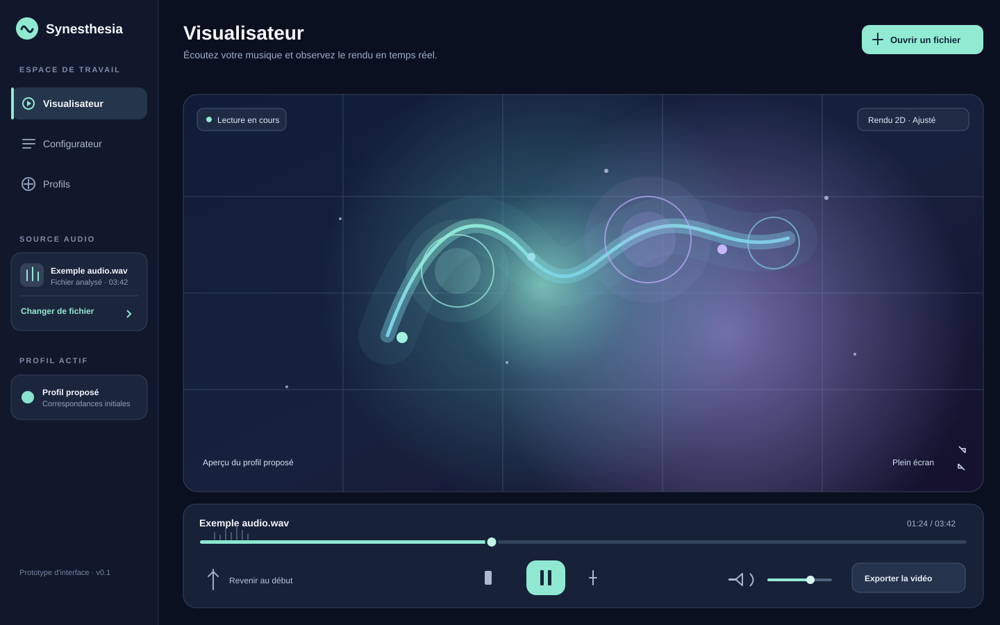
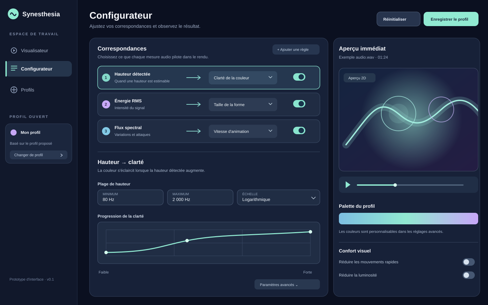
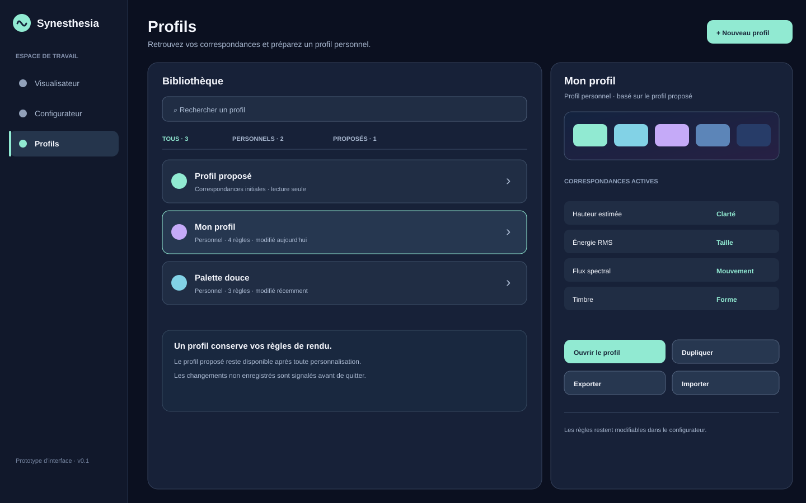
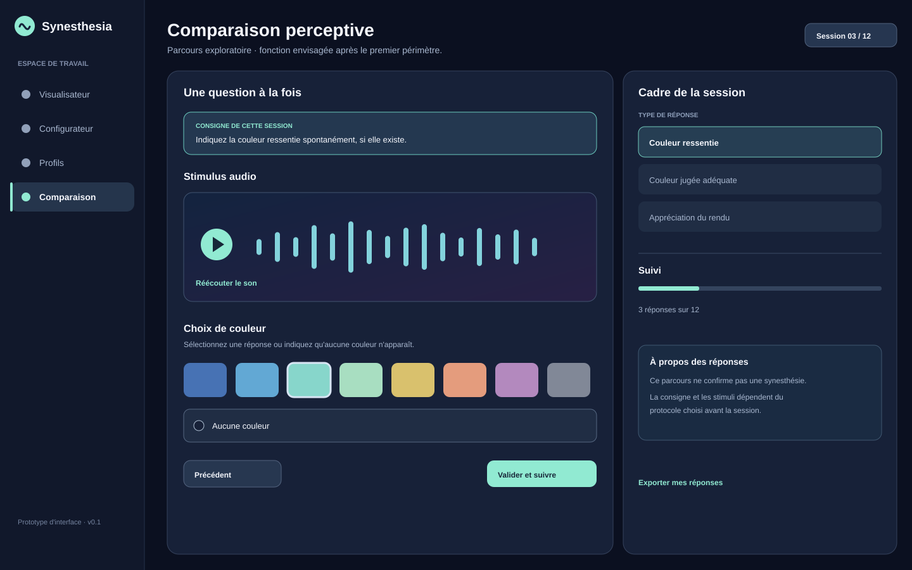
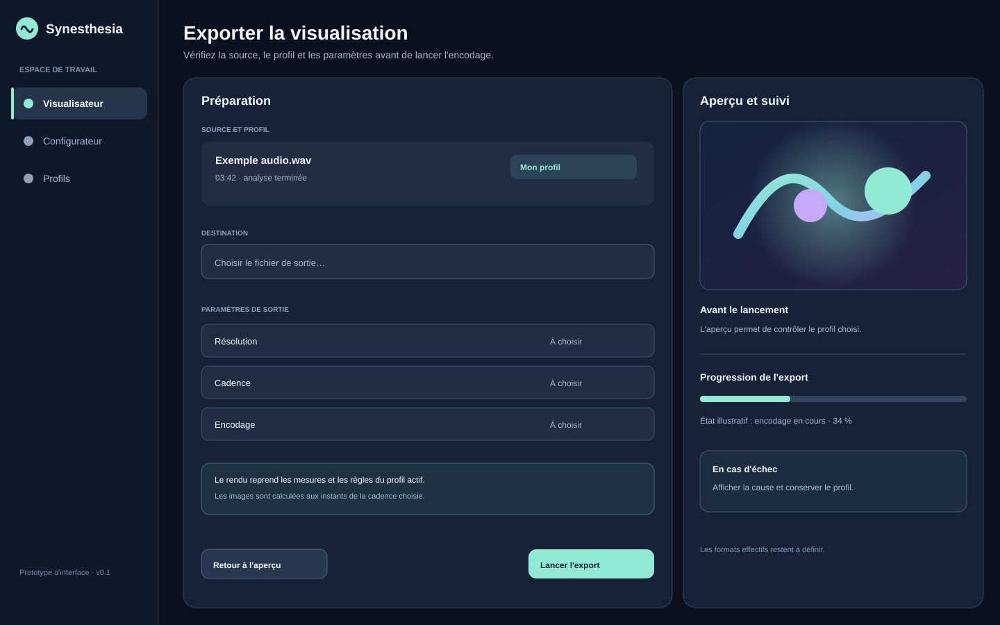
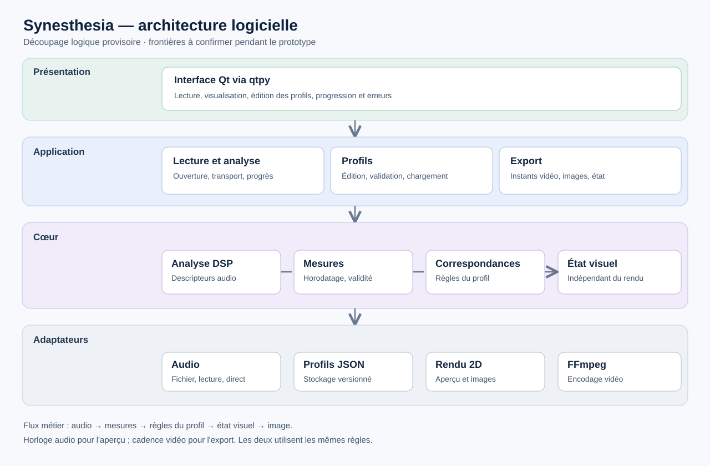

==============================
Cahier des charges Synesthesia
==============================

:Statut: Projet de spécification
:Version: 0.1
:Date: 24 septembre 2026
:Objet: Visualiseur audio interactif inspiré de la :term:`chromesthésie <Chromesthésie>`

Présentation et objectifs
=========================

Synesthesia vise à transformer un signal musical en une représentation visuelle animée inspirée de travaux sur les correspondances auditives et visuelles, notamment sur la :term:`chromesthésie <Chromesthésie>`.
Les relations entre caractéristiques acoustiques et attributs visuels partiront d'hypothèses documentées, resteront personnalisables et devront être évaluées pour le rendu effectivement produit.
Le cœur du logiciel doit permettre d'écouter et de visualiser un fichier audio, puis de produire une vidéo à partir d'une analyse préalable. L'analyse d'une source en direct est envisagée dans un second temps.

Le projet s'adresse aux personnes intéressées par la visualisation musicale et aux personnes présentant une synesthésie son-couleur qui souhaitent définir leurs propres associations.
Une première version pourrait aussi être proposée à des chercheurs intéressés ; son adaptation à une étude dépendra des besoins et du protocole de recherche qui émergeront.
**Il ne prétend ni reproduire une expérience synesthésique universelle, ni établir un diagnostic clinique.**

Les objectifs sont les suivants :

* proposer un rendu réactif et synchronisé avec l'audio ;
* rendre les règles de correspondance visibles, modifiables et sauvegardables ;
* permettre la comparaison entre un profil prédéfini et un profil personnel ;
* garantir qu'un rendu exporté corresponde aux paramètres utilisés à l'écran ;
* conserver la provenance scientifique et le statut expérimental de chaque règle proposée.

Orientations de conception
--------------------------

Les arbitrages suivants donnent une direction au premier prototype. Ils resteront révisables lorsque l'implémentation et les mesures feront apparaître des contraintes nouvelles.

* L'interface sera une application autonome fondée sur Qt, pensée pour une utilisation sans connaissances en programmation ni en traitement du signal.
* Le premier rendu sera en 2D. Une autre technique de rendu ne sera introduite que si les besoins observés et les mesures le justifient.
* Les règles proposées au démarrage seront explicites et modifiables ; les choix personnels seront enregistrables dans des profils.
* Le premier prototype suivra la voie Python décrite plus loin. Un composant pourra être porté en C++20 si son coût mesuré le nécessite.
* Les correspondances issues de la littérature serviront à formuler des hypothèses de rendu, non à promettre la restitution fidèle d'une expérience synesthésique.
* L'entrée audio en direct est envisagée après le cœur lecture–visualisation–personnalisation–export. Une adaptation à des études perceptives est une ambition ultérieure, sans engagement de développement pour la première version.


Périmètre et priorités
======================

Le premier périmètre fonctionnel comprend la lecture d'un fichier audio, l'analyse de caractéristiques acoustiques, un rendu visuel 2D, l'édition de correspondances, la gestion de profils et l'export vidéo.
L'entrée audio en direct est envisagée après ce premier périmètre.
La première version pourra être proposée à des chercheurs intéressés, sans intégrer de recueil de réponses ni imposer d'étude auprès de participants.
Une adaptation à un protocole de recherche pourra être étudiée ensuite avec les personnes concernées.
La 3D, la classification automatique d'instruments, les traitements GPU avancés et le traitement par lots sont des évolutions possibles ; leur présence dans l'ébauche ne constitue pas encore un engagement pour la première version.

Les formats audio d'entrée, les :term:`codecs <Codec>` vidéo, les systèmes d'exploitation cibles et les résolutions de sortie ne sont pas encore arrêtés.

Licence et diffusion
====================

Synesthesia est destiné à être diffusé comme logiciel libre et open source sous la licence GNU Affero General Public License version 3 (:term:`AGPLv3 <AGPLv3 (GNU Affero General Public License version 3)>`), dont le texte figure dans `LICENSE.md <../LICENSE.md>`_.
Ce choix permet l'utilisation, l'étude, la modification et la redistribution du logiciel, y compris dans un cadre commercial, sous réserve du respect des conditions de la licence.
Lorsqu'une version couverte est redistribuée, le code source correspondant doit être mis à disposition selon les modalités de l'AGPLv3 ; une version modifiée accessible à des utilisateurs par un réseau doit également leur proposer ce code source conformément à la section 13.
Ces obligations concernent le logiciel couvert et son code source correspondant, et ne signifient pas que tous les logiciels ou toutes les données d'un utilisateur doivent être publiés.

L'auteur ne prévoit pas de commercialiser le visualiseur.
Si une organisation souhaite intégrer du code dont l'auteur détient les droits dans un produit distribué sous des conditions incompatibles avec l'AGPLv3, elle pourra solliciter un accord de licence distinct.
Un tel accord n'est ni automatique ni nécessaire pour une utilisation commerciale conforme à l'AGPLv3 ; il suppose que les droits requis sur les contributions et les dépendances concernées soient disponibles.
Les licences de la pile logicielle et les options de compilation de FFmpeg seront vérifiées avant la distribution.

Fondements scientifiques
========================

Il faut distinguer une correspondance observée lors d'une tâche expérimentale, une couleur effectivement éprouvée par une personne :term:`synesthète <Synesthète>`, et une règle de génération d'images choisie pour le logiciel.
Une association de groupe ne définit pas la perception d'un individu et ne démontre pas qu'un rendu sera « naturel » ou apprécié par tous.

Les notices et limites de chaque étude mobilisée sont conservées dans l':ref:`annexe-etudes`.

Les correspondances observées à l'échelle d'un groupe ne définissent pas une perception universelle.
Lors de présentations répétées des mêmes sons, les personnes synesthètes choisissent en moyenne des couleurs plus constantes que les témoins, mais le contenu de leurs associations peut varier sensiblement d'un individu à l'autre :cite:p:`ward_sound-colour_2006,ward_synaesthesia_2025`.
Plusieurs études portant spécifiquement sur des synesthètes reposent par ailleurs sur des effectifs restreints — 10 synesthètes dans :cite:p:`zamm_pathways_2013`, 14 dans :cite:p:`neufeld_feedback_2012` et 20 personnes recrutées, dont 10 retenues pour les analyses comparatives, dans :cite:p:`reuter_rainbows_2025` — ce qui impose de rester prudent quant à la généralisation de leurs résultats.

Des régularités partagées existent néanmoins dans certaines tâches.
Par exemple, l'association entre hauteur tonale et clarté apparaît chez les synesthètes comme chez les témoins dans :cite:p:`ward_sound-colour_2006`.
Plus généralement, l'apprentissage et l'environnement peuvent contribuer au **contenu** de certaines associations : :cite:t:`witthoft_learned_2015` identifient notamment des profils graphème–couleur compatibles avec l'influence d'un même jeu de lettres colorées durant l'enfance.
La langue influe sur certaines associations graphème–couleur chez des synesthètes :cite:p:`root_language_2021`. Dans d'autres populations, les associations entre mots de couleur et émotions varient entre pays :cite:p:`jonauskaite_color_emotion_2020`, et l'exposition à la musique occidentale est liée aux jugements de bonheur suscités par des cadences majeures ou mineures :cite:p:`smit_papua_2022`.
Ces résultats ne démontrent toutefois ni l'existence d'une palette synesthésique commune à une culture, ni l'existence de correspondances musique–couleur universelles.

Ces résultats justifient des *hypothèses de rendu* configurables, à comparer empiriquement avec d'autres correspondances et avec les choix individuels. Ils ne justifient ni une palette « scientifiquement exacte » ni un test diagnostique.

Synesthesia utilisera donc par défaut des correspondances choisies parmi les régularités les mieux étayées par la littérature, tout en permettant à l'utilisateur de modifier ces associations afin de représenter ses propres correspondances perceptives.
À plus long terme, la comparaison anonymisée de profils individuels pourrait permettre d'étudier leur variabilité et de rechercher d'éventuelles régularités entre utilisateurs ; cette possibilité constitue cependant une perspective de recherche et ne fait pas partie du périmètre de la première version.


Parcours utilisateur
====================

Lecture et personnalisation d'un fichier
-----------------------------------------

#. L'utilisateur ouvre un fichier audio et voit sa durée, son état de chargement et les éventuelles erreurs de décodage.
#. L'application analyse le fichier, puis affiche une prévisualisation synchronisée avec les commandes de lecture, pause et recherche temporelle.
#. L'utilisateur choisit un :term:`profil de correspondance <Profil de correspondance>` et ajuste les paramètres tout en observant leur effet.
#. Il enregistre son profil et peut exporter la visualisation avec la piste audio, selon les formats retenus.

Visualisation d'une entrée audio en direct
------------------------------------------

#. L'utilisateur choisit une source audio autorisée par le système.
#. Le rendu réagit au flux disponible, avec indication explicite de l'état de capture, de la latence et des éventuelles pertes de données.
#. L'utilisateur peut arrêter la capture sans fermer l'application.

Usage de recherche éventuel
---------------------------

Si un projet de recherche le justifie, une version adaptée pourrait présenter des :term:`stimuli <Stimulus>` dans un ordre contrôlé et recueillir des réponses.
Le parcours, les consignes, le consentement et l'interprétation dépendraient alors du protocole défini pour cette étude.
Il faudrait notamment distinguer association ressentie, couleur jugée adéquate et appréciation esthétique, qui ne mesurent pas le même phénomène (:cite:p:`ward_synaesthesia_2025` ; :cite:p:`isbilen_color_2016`).

Exigences fonctionnelles
========================

Les identifiants ci-dessous servent à suivre le périmètre du logiciel. « P1 » désigne le cœur de la première livraison ; « P2 » une extension envisagée ; « P3 » une possibilité de recherche sans engagement de réalisation.

.. list-table:: Fonctions et pistes d'évolution
   :header-rows: 1
   :widths: 10 10 80
   :class: fixed-widths

   * - ID
     - Priorité
     - Exigence
   * - F-01
     - P1
     - Charger un fichier audio pris en charge et signaler clairement les fichiers illisibles ou incompatibles.
   * - F-02
     - P1
     - Fournir lecture, pause, arrêt et déplacement dans la durée du fichier, avec synchronisation du rendu après chaque déplacement.
   * - F-03
     - P1
     - Pré-analyser le fichier et conserver des mesures indexées dans le temps pour la lecture et l'export.
   * - F-04
     - P1
     - Calculer au minimum l'énergie :term:`RMS <RMS (Root Mean Square)>`, une mesure de hauteur lorsque celle-ci est estimable, le centroïde et le flux spectraux ; expliciter les valeurs absentes ou peu fiables.
   * - F-05
     - P1
     - Appliquer un profil de règles audio-visuelles et afficher le résultat en 2D pendant la lecture.
   * - F-06
     - P1
     - Modifier les plages, seuils, :term:`courbes de transfert <Courbe de transfert>`, :term:`palettes <Palette>` et attributs visuels exposés par le profil.
   * - F-07
     - P1
     - Créer, dupliquer, charger, enregistrer et exporter un profil personnel ; distinguer ce profil du profil proposé par défaut.
   * - F-08
     - P1
     - Exporter une vidéo synchronisée avec le fichier audio et fournir un message d'erreur exploitable en cas d'échec.
   * - F-09
     - P2
     - Visualiser une entrée audio en direct, avec choix de la source et retour sur l'état de capture.
   * - F-10
     - P3
     - Étudier, si un projet de recherche le demande, l'adaptation du logiciel à une session de comparaison perceptive avec :term:`stimuli <Stimulus>` et recueil de réponses selon un protocole défini séparément.

Le format des profils reste à définir. Un format de réponses perceptives ne serait étudié que si une adaptation à la recherche était décidée.
Le JSON est proposé par l'ébauche comme format d'échange ; son schéma, ses versions et ses règles de migration devront être spécifiés avant de figer une API ou des données persistantes.

Chaîne d'analyse et règles de rendu
===================================

Le traitement sépare l'acquisition ou le décodage, l'extraction des mesures, leur :term:`normalisation <Normalisation>`, l'application des règles et le rendu.
La pré-analyse conserve des repères temporels permettant de retrouver les mesures à tout instant du fichier. Pour un morceau polyphonique, la hauteur estimée ne doit pas être présentée comme une note unique toujours identifiable : l'unité représentée, le niveau de confiance et la réponse visuelle en l'absence de hauteur fiable seront définis avant d'implémenter F-04.
Le direct utilise la même :term:`sémantique <Sémantique>` de mesures, avec des contraintes de calcul et de mémoire adaptées au flux continu.

.. list-table:: Hypothèses de correspondance initiales
   :header-rows: 1
   :widths: 20 20 40 20
   :class: fixed-widths

   * - Mesure audio
     - Attribut visuel candidat
     - Niveau de preuve et précaution
     - Article
   * - :term:`Hauteur fondamentale <Hauteur fondamentale>` :math:`f_0`
     - Clarté, taille ou position verticale
     - Tendances de groupe ; association positionnelle dépendante de la tâche.
       Ne pas créer de hauteur pour le silence ou un signal sans estimation fiable.
     - :cite:p:`ward_sound-colour_2006` ; :cite:p:`spence_crossmodal_2011` ; :cite:p:`adeli_audiovisual_2014`
   * - Énergie :term:`RMS <RMS (Root Mean Square)>`
     - Taille ou intensité de l'animation
     - Choix de conception à évaluer ; le RMS n'est pas identique à la :term:`sonie <Sonie>` perçue.
       Prévoir seuils et compression visuelle.
     - Pas de validation directe dans les études retenues
   * - :term:`Centroïde spectral <Centroïde spectral>`
     - Paramètre à tester pour la forme ou la couleur
     - Des corrélations avec des couleurs sont rapportées pour certains :term:`stimuli <Stimulus>`, sans loi universelle ni preuve d'un lien avec l'angularité.
     - :cite:p:`reuter_rainbows_2025` ; :cite:p:`reymore_color_2025`
   * - :term:`Flux spectral <Flux spectral>`
     - :term:`Attaques <Attaque>`, vitesse ou déformation temporaire
     - Choix de conception temporelle, sans correspondance perceptive directe établie par les articles cités.
       Séparer attaques et bruit.
     - Pas de validation directe dans les études retenues
   * - Descripteurs de :term:`timbre <Timbre>`, dont :term:`MFCC <MFCC (Mel-Frequency Cepstral Coefficients)>` si retenus
     - Forme arrondie ou anguleuse
     - Correspondance démontrée pour les timbres testés, mais aucune formule reliant les MFCC ou le centroïde à la forme n'a été validée.
     - :cite:p:`adeli_audiovisual_2014` ; :cite:p:`richan_proposal_2021`
   * - Indices musicaux globaux, si estimables
     - :term:`Palette <Palette>` ou ambiance
     - Effet observé sur les choix de couleurs pour des extraits précis ; ne pas déduire une émotion d'un mode ou d'une seule mesure.
     - :cite:p:`palmer_musiccolor_2013` ; :cite:p:`palmer_melodies_2016` ; :cite:p:`isbilen_color_2016`

Pour chaque mesure, spécifier avant implémentation les unités, le domaine de valeurs, le traitement des canaux et du rééchantillonnage, la position temporelle de la fenêtre, l'interpolation entre fenêtres et la représentation d'une valeur absente ou peu fiable. Les paramètres de :term:`fenêtre d'analyse <Fenêtre d'analyse>`, de :term:`pas temporel <Pas temporel>`, de :term:`lissage <Lissage>`, de normalisation et de traitement des silences doivent être documentés avec les résultats.
Les couleurs et les formes configurées par l'utilisateur priment sur les valeurs proposées.
Les effets de persistance visuelle sont une option de rendu réglable, et leur impact sur la lisibilité doit être évalué.

Interface et ergonomie
======================

L'interface doit permettre à une personne non programmeuse de démarrer une lecture avec un profil prédéfini sans manipuler de paramètres :term:`DSP <DSP (Digital Signal Processing)>`.
Les réglages détaillés seront accessibles progressivement, avec unités, valeurs courantes, possibilité de réinitialiser et aperçu immédiat.
Les commandes de lecture, l'état du fichier, le profil actif et l'état de l'export doivent rester identifiables.
Les mouvements rapides, la luminosité et les contrastes du rendu doivent pouvoir être réduits.

Maquettes des écrans
--------------------

Les esquisses ci-dessous proposent une organisation initiale des parcours. Elles ne fixent ni la disposition finale des widgets ni les valeurs des réglages ; leur ergonomie sera reprise pendant le prototypage.

Visualisateur
~~~~~~~~~~~~~



   Lecture d'un fichier et aperçu du rendu.

Configurateur
~~~~~~~~~~~~~



   Édition des règles d'un profil.

Gestion des profils
~~~~~~~~~~~~~~~~~~~



   Création, duplication, chargement et export des profils.

Usage de recherche éventuel
~~~~~~~~~~~~~~~~~~~~~~~~~~~



   Esquisse d'un usage de recherche possible, hors première livraison ; elle ne fixe ni les consignes ni le protocole.

Export vidéo
~~~~~~~~~~~~



   Préparation et suivi d'un export.


Architecture et choix techniques
================================

L'architecture sépare le décodage et la lecture audio, l'acquisition en direct, l'analyse :term:`DSP <DSP (Digital Signal Processing)>`, les :term:`profils de correspondance <Profil de correspondance>`, le rendu et l'export vidéo.
Les mesures calculées en direct et hors ligne partagent une représentation horodatée, avec une définition commune des unités, :term:`fenêtres d'analyse <Fenêtre d'analyse>` et règles de correspondance.
La lecture audio fournit l'horloge de référence à la prévisualisation ; l'export construit ses images à partir des mêmes mesures et du même profil, aux instants déterminés par la cadence vidéo. Les effets à mémoire devront préciser leur état initial et leur reconstruction après un déplacement temporel.
Cette séparation permet de remplacer un composant mesuré comme insuffisant sans réécrire les profils ni les règles de rendu.

Découpage logiciel provisoire
-----------------------------

La structure ci-dessous décrit les responsabilités et les échanges entre couches, sans arrêter l'arborescence des modules, les classes ni les signatures des fonctions.
L'API évoquée ici est d'abord une interface interne entre composants ; l'exposition d'une API publique pour des logiciels tiers reste une décision distincte.



   Architecture logique envisagée. Les flèches indiquent les appels entre couches ; les composants et leurs interfaces exactes restent à définir.

.. list-table:: Responsabilités des couches
   :header-rows: 1
   :widths: 15 50 35
   :class: fixed-widths

   * - Couche
     - Responsabilité
     - Frontière proposée
   * - Présentation
     - Afficher le lecteur, le rendu, l'éditeur de profils et les états des opérations ; transmettre les actions de l'utilisateur.
     - Qt via PySide6 ; aucun calcul DSP ni accès direct au stockage depuis les widgets.
   * - Application
     - Orchestrer l'ouverture, la pré-analyse, la lecture, la recherche temporelle, la gestion des profils et l'export ; suivre la progression et les erreurs.
     - Dépend des contrats du cœur et pilote les adaptateurs ; préserve la réactivité de l'interface pendant les opérations longues.
   * - Cœur
     - Définir les mesures horodatées, leur validité et leurs unités ; calculer les descripteurs, appliquer un profil et produire un état visuel indépendant de l'affichage.
     - Les règles de correspondance ne dépendent ni de Qt, ni du format JSON, ni de FFmpeg.
   * - Adaptateurs
     - Décoder et lire l'audio, *capter une source directe si retenue*, enregistrer les profils, dessiner les images et encoder la vidéo.
     - Encapsulent les bibliothèques et les formats concrets derrière les contrats utilisés par l'application et le cœur.

Les frontières de données à préciser en premier sont les suivantes :

* **Audio :** échantillons et métadonnées nécessaires à l'analyse, avec définition du nombre de canaux, de la fréquence d':term:`échantillonnage <Échantillonnage>` et de l'origine temporelle.
* **Mesures :** valeurs horodatées, unités, paramètres d'analyse et indicateur explicite d'absence ou de fiabilité insuffisante ; la pré-analyse et le direct doivent conserver la même :term:`sémantique <Sémantique>`.
* **Profil :** règles et paramètres de correspondance validés, séparés de leur représentation JSON ; un numéro de version permettra de faire évoluer le format persistant.
* **État visuel :** description des attributs à dessiner pour un instant donné, indépendante du widget, de la résolution et de l'encodeur.
* **Résultat d'opération :** progression, annulation possible lorsque pertinente et erreur exploitable par l'interface, sans exposer directement les exceptions des bibliothèques tierces.

Pour la prévisualisation, l'horloge de lecture audio détermine l'instant interrogé dans les mesures pré-analysées ; les règles du profil produisent l'état visuel correspondant.
Pour l'export, les instants sont déterminés par la cadence vidéo et interrogent les mêmes mesures et règles ; le même contrat de rendu doit être utilisé pour obtenir les images, même si la cible d'affichage diffère.
La capture directe, *si elle est développée*, alimentera le cœur avec des mesures de même forme, mais sans exiger de conserver toute l'histoire du flux en mémoire.

Les dépendances doivent rester orientées vers les contrats du cœur et de l'application : un adaptateur concret peut être remplacé sans modifier les règles de correspondance.
Un portage ciblé en C++20 pourra être placé derrière une frontière mesurée comme coûteuse, par exemple l'extraction d'un descripteur, sans imposer le C++ au reste de l'application.
Le traitement audio continu, l'analyse longue et l'export ne doivent pas bloquer la boucle d'événements Qt ; la stratégie d'exécution et les échanges entre tâches seront choisis après mesure.

Organisation prévisionnelle du code
----------------------------------

Le paquet ``synesthesia`` reste à la racine du dépôt. Les noms ci-dessous désignent des responsabilités possibles, et non des sous-dossiers à créer dès le départ :

* ``analysis`` : extraction des mesures et descripteurs audio ;
* ``mapping`` : profils, règles de correspondance et état visuel ;
* ``rendering`` : production d'une image à partir de l'état visuel ;
* ``io`` : fichiers et flux audio, persistance des profils et export vidéo ;
* ``ui`` : fenêtres et widgets Qt ;
* ``tools`` : utilitaires transversaux réutilisables.

Le code peut commencer dans quelques modules du paquet existant. Une fonction courte de lecture ou d'écriture peut rejoindre un module d'entrées-sorties commun ; elle ne justifie pas à elle seule un fichier ou un dossier.
Les fonctions liées seront séparées lorsque leur volume, leurs dépendances ou leurs cycles de vie rendront cette séparation utile.
La lecture audio continue et l'encodage vidéo pourront notamment évoluer indépendamment des simples fonctions d'ouverture et de sauvegarde.
Les couches du schéma précédent restent des responsabilités logiques : leur nombre ne détermine pas celui des paquets Python.

Le détail des bibliothèques envisagées, des solutions écartées pour le prototype et de la comparaison Python/C++ figure dans l':ref:`annexe-choix-techniques`.

Décision de pile logicielle
---------------------------

La voie envisagée pour le premier prototype est **Python 3.13**, avec ``NumPy`` / ``SciPy`` pour le socle DSP, ``librosa`` pour les fonctions musicales utiles, ``soundfile`` pour les fichiers, ``sounddevice`` pour la lecture et la capture, ``Qt`` via ``PySide6`` pour l'interface, et ``FFmpeg`` externe pour l'export.
Le rendu commence en 2D avec Qt ; ``ModernGL`` sera évalué si les besoins de rendu dépassent les capacités mesurées de cette première solution.
Ce choix favorise l'itération sur les correspondances perceptives et la cohérence entre aperçu et export, tout en conservant la possibilité de porter en C++20 un composant dont le profilage démontre le besoin.
Il ne présume ni qu'un portage sera nécessaire, ni que son coût sera négligeable.

Python 3.13 sert de cible initiale de développement.
Les bibliothèques graphiques ou d'analyse optionnelles ne déterminent pas à elles seules la compatibilité avec Python 3.14 ;
celle-ci sera évaluée sur la pile effectivement nécessaire et les plateformes retenues, y compris la liaison Qt et les dépendances transitives.
Les versions exactes des bibliothèques ne seront pas figées par principe.
Des versions minimales seront indiquées uniquement lorsqu'une fonctionnalité, une correction ou la compatibilité avec Python l'exige, avec une vérification d'installation sur chaque plateforme cible.

Avant distribution, la compatibilité des licences de la pile effectivement retenue et des options de compilation de ``FFmpeg`` avec l':term:`AGPLv3 <AGPLv3 (GNU Affero General Public License version 3)>` devra être vérifiée.
Les formats audio, codecs vidéo, systèmes d'exploitation et matériels de référence restent à fixer comme indiqué dans les décisions ouvertes du CDC. Cette pile décrit une intention de conception : les dépendances applicatives ne seront déclarées dans le paquet qu'au fur et à mesure de leur usage et de leur vérification sur les plateformes cibles.

Exigences non fonctionnelles
============================

* **Synchronisation :** l'audio sert de référence temporelle en lecture ; les événements visuels et les images exportées portent un :term:`horodatage <Horodatage>` cohérent, y compris après pause ou déplacement dans le fichier. La validation distinguera le décalage fixe, la gigue et la durée des images, en lecture de fichier comme en capture directe.
* **Réactivité :** viser un affichage fluide à 60 images par seconde sur une configuration de référence à définir.
  La cible de latence audio-visuel inférieure à 20 ms mentionnée dans l'ébauche doit être précisée par une méthode de mesure, un mode d'exécution et un matériel de référence avant de devenir un critère d'acceptation.
* **Robustesse :** les entrées invalides, le silence, les fichiers longs, les interruptions de capture et les échecs d'export produisent un état compréhensible sans perdre un profil enregistré.
* **Reproductibilité :** à source, profil, paramètres, graines aléatoires et versions des composants identiques, l'export hors ligne doit produire le même enchaînement d'états visuels. Cette exigence ne promet pas des fichiers vidéo identiques bit à bit entre encodeurs ou plateformes.
* **Confidentialité :** les fichiers audio restent locaux par défaut ; tout partage futur nécessite une décision explicite. Si un module de recherche recueille des réponses perceptives, leur conservation et leur partage devront être définis par le protocole correspondant.
* **Accessibilité :** les réglages ne doivent pas dépendre uniquement de la couleur ; les libellés et indicateurs de statut doivent rester lisibles.

Vérification du logiciel
========================

La première livraison devra être vérifiée sur les fonctions qu'elle annonce : ouverture des formats retenus, lecture et déplacement temporel, traitement du silence et des erreurs, sauvegarde puis rechargement d'un profil, et cohérence de l'aperçu avec l'export.
Des signaux simples et des fichiers de référence reproductibles seront choisis au moment d'implémenter ces fonctions.
Les mesures de performance accompagneront les fonctionnalités effectivement livrées et préciseront la machine, la source audio, la résolution, la cadence et la méthode de chronométrage.
Les seuils chiffrés seront fixés lorsque les formats, plateformes et matériels cibles seront connus ; ce CDC n'impose pas dès maintenant une matrice exhaustive de tests d'acceptation.

Une étude perceptive destinée à évaluer les correspondances ou l'effet du visualiseur reste une possibilité de recherche, distincte de ces vérifications et sans conditionner la première livraison. Les pistes méthodologiques déjà relevées sont conservées dans l':ref:`annexe-etude-optionnelle`.


Livrables et feuille de route provisoire
========================================

Le développement est mené en autonomie, sur le temps libre de l'auteur, sans calendrier imposé ni revue externe planifiée.
Les étapes ci-dessous décrivent un ordre de travail provisoire, sans date ni engagement de durée.
Les livrables envisagés sont l'application, les profils fournis, la documentation utilisateur et technique, des exemples reproductibles servant aux vérifications fonctionnelles, ainsi qu'un exemple de vidéo exportée. D'éventuels résultats d'étude perceptive constitueraient un livrable distinct.

.. list-table:: Étapes envisagées
   :header-rows: 1
   :widths: 15 45 40
   :class: fixed-widths

   * - Étape
     - Travail principal
     - Résultat attendu
   * - Cadrage
     - Fixer progressivement les formats, plateformes et matériels cibles, le périmètre de la première livraison et les vérifications fonctionnelles associées.
     - Choix nécessaires à l'implémentation explicités, sans figer prématurément le calendrier.
   * - Chaîne audio et analyse
     - Charger et lire un fichier ; produire les mesures horodatées, traiter les silences et les erreurs, et vérifier les résultats sur des signaux de référence.
     - Analyse reproductible exploitable pendant la lecture et l'export.
   * - Visualiseur 2D
     - Synchroniser lecture, déplacement temporel, profil prédéfini et rendu ; construire une interface utilisable sans connaissance du :term:`DSP <DSP (Digital Signal Processing)>`.
     - Première prévisualisation interactive couvrant le parcours de lecture.
   * - Personnalisation
     - Définir le schéma versionné des profils, puis permettre l'édition des règles et :term:`palettes <Palette>` ainsi que l'enregistrement et le rechargement des profils.
     - Un profil personnel rechargé reproduit le même rendu.
   * - Export et finition
     - Produire la vidéo à partir des mêmes mesures et règles que l'aperçu ; vérifier les cas difficiles, l'ergonomie, l'accessibilité et les performances sur le matériel retenu.
     - Première version aboutie couvrant les exigences P1 et accompagnée de sa documentation.
   * - Diffusion et publication éventuelle
     - Mettre l'outil et sa documentation à disposition ; si une publication est entreprise, présenter les fondements scientifiques, les choix de conception, l'implémentation et les limites du visualiseur.
     - Logiciel diffusé selon le périmètre retenu ; article éventuel décrivant le projet, distinct d'une étude scientifique des correspondances qui exigerait un protocole propre.

L'entrée audio en direct (F-09) reste une extension envisagée. La diffusion de la première version pourra permettre de recueillir l'intérêt de chercheurs pour l'outil ; une adaptation à leurs protocoles (F-10) et une étude perceptive feraient l'objet de décisions et d'un calendrier distincts.

Décisions encore ouvertes
-------------------------

Avant de préciser les vérifications fonctionnelles, il reste à décider :

* des plateformes, formats, matériels cibles et modalités de distribution de FFmpeg ;
* du périmètre exact de la première livraison et des démonstrations attendues à chaque jalon ;
* de la compatibilité des dépendances retenues avec l':term:`AGPLv3 <AGPLv3 (GNU Affero General Public License version 3)>` ;
* du schéma des profils ;
* du comportement détaillé des écrans et de l'évaluation ergonomique des esquisses ;
* des seuils de latence, fluidité, durée d'analyse et qualité d'export, avec matériel et méthode de mesure.

Si une adaptation à une étude est décidée, il faudra alors définir le format des réponses perceptives, les modalités de consentement, de conservation et de suppression des données, avant toute collecte auprès de tiers.


.. _annexe-etudes:

Annexe A — Notices des études citées
====================================

Ces notices explicitent les résultats et leurs limites pour le projet. Elles documentent les sources utilisées dans les fondements et les hypothèses de rendu ; elles ne constituent pas une validation du visualiseur.

* :cite:t:`ward_sound-colour_2006` (`article <https://doi.org/10.1016/S0010-9452(08)70352-6>`_) comparent des personnes présentant une :term:`synesthésie <Synesthésie>` son-couleur à des témoins.
  Les deux groupes emploient notamment une association entre :term:`hauteur tonale <Hauteur tonale>` et clarté de la couleur ; les réponses synesthétiques sont plus précises et plus cohérentes.
  L'article ne fixe aucune fonction mathématique reliant la hauteur à la clarté ni une teinte par note.
* :cite:t:`zamm_pathways_2013` (`article <https://doi.org/10.1016/j.neuroimage.2013.02.024>`_) comparent 10 synesthètes musique–couleur confirmés par des tâches répétées à 10 témoins appariés.
  Une :term:`anisotropie fractionnelle <Anisotropie fractionnelle>` plus élevée du faisceau fronto-occipital inférieur droit est associée au groupe et à la constance des réponses.
  Cette mesure de diffusion ne montre ni le sens des connexions, ni une cause de la synesthésie, ni une règle de correspondance musicale.
  L'effectif exige une :term:`réplication <Réplication>`.
* :cite:t:`neufeld_feedback_2012` (`article <https://doi.org/10.1016/j.neuropsychologia.2012.02.032>`_) comparent, en :term:`IRMf <IRMf (Imagerie par Résonance Magnétique fonctionnelle)>` pendant des sons non verbaux, 14 synesthètes audio–visuels associateurs et 14 témoins.
  La :term:`connectivité fonctionnelle <Connectivité fonctionnelle>` du cortex pariétal inférieur gauche avec des régions auditives et visuelles primaires est plus élevée chez les synesthètes ;
  aucune différence directe entre régions auditives et visuelles **examinées** n'est détectée.
  Cette corrélation ne révèle ni le sens des échanges, ni une désinhibition effective, ni une cause.
  Les résultats de Neufeld et les mesures de diffusion de Zamm portent sur des indicateurs différents et ne démontrent pas un mécanisme neural unique.
* :cite:t:`witthoft_learned_2015` (`article <https://doi.org/10.1371/journal.pone.0118996>`_) trouvent, parmi 6 588 synesthètes graphème–couleur recrutés en ligne, 400 profils dont au moins dix associations lettre–couleur correspondent à un jeu de lettres colorées de l'enfance.
  La distribution des dates de naissance renforce l'hypothèse d'un apprentissage du **contenu** des associations.
  La possession du jeu n'est pas établie pour chaque personne et ce résultat ne mesure ni la prévalence en population générale, ni la cause de la synesthésie, ni des associations musique–couleur.
* :cite:t:`spence_crossmodal_2011` (`article <https://doi.org/10.3758/s13414-010-0073-7>`_) rapporte des associations fréquentes entre sons aigus et objets petits, clairs et placés haut.
  Il s'agit de tendances dépendant des tâches et des :term:`stimuli <Stimulus>`, sans rapport mathématique universel.
* :cite:t:`spence_distefano_2022` (`article <https://doi.org/10.1177/20416695221092802>`_) distinguent l'analogie entre octave et cercle chromatique d'une correspondance perceptive démontrée.
  Elle ne valide aucune conversion physique note–teinte ;
  elle présente l'émotion comme une explication plausible des choix musique–couleur, sans preuve causale exclusive ni nouvelle cohorte.
* :cite:t:`chiou_cross-modality_2012` (`article <https://doi.org/10.1068/p7161>`_) montrent que le lien hauteur-position peut guider l'attention, tout en étant sensible au contexte et au contrôle volontaire.
* :cite:t:`adeli_audiovisual_2014` (`article <https://doi.org/10.3389/fnhum.2014.00352>`_) ne retrouvent pas d'association ordonnée entre :term:`hauteur fondamentale <Hauteur fondamentale>` et position verticale avec leurs sons instrumentaux : cette divergence doit être prise en compte.
  Ils observent, auprès de 119 participants et avec 23 sons de niveau égalisé, une association plus forte entre :term:`timbres <Timbre>` doux et formes arrondies, ou timbres rudes et formes anguleuses, qu'entre timbre et couleur, dans un choix parmi trois formes imposées. Le registre modifie aussi les choix pour certains instruments.
  Les expériences « synesthésie-like » déclarées par 31 participants n'ont pas été confirmées par un test diagnostique dans cette étude.
  L'étude ne valide aucun pilotage direct de l'angularité par le centroïde ou les :term:`MFCC <MFCC (Mel-Frequency Cepstral Coefficients)>`.
* :cite:t:`griscom_visualizing_nodate` (`thèse <https://escholarship.org/uc/item/7px9h0gg>`_) observe, dans des tâches de choix contraints, des liens entre intervalles/accords et couleurs, et entre timbres instrumentaux et couleurs, flou ou dynamique lumineuse.
  Les associations aux couleurs covarient surtout avec les jugements émotionnels ou sémantiques ; le flou et la dynamique lumineuse répondent davantage à certaines propriétés acoustiques.
  Les résultats sur les mélanges de timbres concernent un petit ensemble de deux ou trois sources, et ne définissent pas de règle générale de fusion colorée.
* :cite:t:`palmer_musiccolor_2013` (`article <https://doi.org/10.1073/pnas.1212562110>`_) étudient les choix de couleurs de participants non synesthètes pour 18 extraits orchestraux.
  Les correspondances observées sont compatibles avec une :term:`médiation <Médiation>` par les émotions associées à la musique et aux couleurs.
  Les extraits rapides en mode majeur et les extraits lents en mode mineur diffèrent sur plusieurs dimensions ; le mode seul ne détermine pas une :term:`palette <Palette>` et l'étude ne fournit pas de classificateur d'émotion audio.
* :cite:t:`palmer_melodies_2016` (`article <https://doi.org/10.1163/22134808-00002486>`_) manipulent séparément :term:`tempo <Tempo>`, densité de notes, mode et registre dans 64 versions de quatre thèmes de piano, auprès de 21 personnes non synesthètes.
  Ils observent des effets du tempo et du mode sur les choix de couleur, compatibles avec une médiation émotionnelle.
  L'étude permet d'attribuer des effets à ces manipulations dans ce matériel, sans définir une palette pour tout morceau ou valider l'estimation automatique de l'émotion.
* :cite:t:`smit_papua_2022` (`article <https://doi.org/10.1371/journal.pone.0269597>`_) comparent les réponses à des cadences majeures et mineures de groupes différant par leur exposition à la musique occidentale ou apparentée, en Papouasie-Nouvelle-Guinée et à Sydney.
  L'association entre cadences majeures et bonheur rapporté est plus nette dans les groupes exposés ;
  le groupe le moins exposé reste trop incertain pour conclure à un effet nul ou universel.
  Les mélodies de l'étude ne séparent pas le mode de la hauteur moyenne.
  Aucune couleur n'est mesurée : une règle automatique « majeur = palette joyeuse » n'en découle pas.
* :cite:t:`isbilen_color_2016` (`article <https://doi.org/10.1037/pmu0000147>`_) retrouvent, avec des préludes de Bach et huit couleurs proposées, des regroupements liés au tempo, au mode, au registre et aux :term:`attaques <Attaque>`.
  Des évaluations émotionnelles séparées de la musique et des couleurs prédisent les choix observés.
  Les variables musicales varient ensemble ; le résultat ne donne pas une règle de couleur propre à chacune.
  La synesthésie déclarée n'a pas été vérifiée indépendamment dans cette étude.
* :cite:t:`whiteford_color_2018` (`article <https://doi.org/10.1177/2041669518808535>`_) étendent les choix statiques de couleurs à 34 extraits instrumentaux plus variés.
  Après contrôle des évaluations émotionnelles et correction des :term:`comparaisons multiples <Comparaisons multiples>`, leurs corrélations entre propriétés perceptives musicales et couleurs ne restent plus significatives.
  Ce résultat soutient une interprétation émotionnelle dans ce corpus, sans prouver une médiation causale : chaque genre n'est représenté que par un extrait et la direction de certains liens tempo–teinte diffère des corpus classiques.
* :cite:t:`hamilton_fletcher_sound_2017` (`article <https://doi.org/10.1163/22134808-00002567>`_) fixent la luminance dans une tâche d'ajustement de couleur à des sons isolés.
  La fréquence relative aux sons présentés est associée à un :term:`chroma <Chroma>` plus élevé ; les tendances de teinte sont plus variables entre personnes et stimuli.
  L'étude ne valide donc ni teinte fixe par note ni conversion absolue entre fréquence et saturation pour un morceau.
* :cite:t:`cowen_music_2020` (`article <https://doi.org/10.1073/pnas.1910704117>`_) identifient au moins 13 dimensions de ressenti associées à des extraits musicaux, partagées entre leurs groupes américains et chinois.
  Dans leurs tâches, les catégories précises prédisent entre groupes les jugements activation–valence au moins aussi bien que ces deux échelles.
  Ce résultat concerne l'émotion musicale, pas les couleurs choisies : les deux facteurs de :cite:p:`whiteford_color_2018` restent une simplification utile à tester pour leur tâche, pas une description exhaustive à imposer à tout morceau.
* :cite:t:`jonauskaite_color_emotion_2020` (`article <https://doi.org/10.1177/0956797620948810>`_) observent des associations entre 12 **mots de couleur** et 20 concepts émotionnels
  auprès de 4 598 personnes dans 30 pays.
  Les profils présentent une similarité moyenne élevée, mais des différences liées au pays, à la proximité linguistique et géographique demeurent.
  L'étude ne montre ni l'émotion produite par des couleurs affichées, ni une palette musique–couleur universelle.
* :cite:t:`pillay_intervals_2026` (`article <https://doi.org/10.3389/fpsyg.2026.1744946>`_) trouvent des différences de jugements de clarté, rugosité, chaleur
  de couleur et émotion pour 13 intervalles harmoniques présentés à 303 personnes au Royaume-Uni. Le choix de couleur est binaire (chaud/froid) et aucun visualiseur n'est évalué.
  Le codage chaud/froid est contradictoire entre le tableau 3 et la section d'analyse ; aucun coefficient ou sens de codage ne doit être repris sans vérification des données et scripts.
* :cite:t:`ward_synaesthesia_2025` (`article <https://doi.org/10.1177/03057356241250020>`_) comparent les réponses répétées à 24 notes isolées variant en hauteur et en timbre.
  Les associations des personnes synesthètes sont en moyenne plus constantes, mais la constance seule discrimine imparfaitement les groupes (AUC 0,723 dans ce protocole).
  L'étude sépare hauteur, :term:`classe de hauteur <Classe de hauteur>` et timbre, et propose une réponse « aucune couleur » aux témoins dans une des conditions.
  Elle ne fournit pas de test diagnostique prêt à intégrer.
* :cite:t:`williamson_prevalence_2026` (`article <https://doi.org/10.1177/03010066251390106>`_) comparent 395 musiciens et 608 non-musiciens recrutés principalement
  dans la région d'Austin et sur une plateforme en ligne ciblant les États-Unis.
  Une déclaration initiale de synesthésie précède les tests ; le test son–couleur combine plusieurs indices sur 24 notes isolées.
  Au seuil principal, l'association avec l'activité musicale est positive (rapport de cotes 4,211 pour la forme son–couleur), mais la fréquence estimée varie avec le seuil.
  Cette étude transversale ne montre ni causalité, ni palette partagée, ni réponse à de la musique complexe.
* :cite:t:`giannakis_comparative_2006` (`article <https://doi.org/10.1017/S1355771806001531>`_) compare deux systèmes de correspondances visuelles pour reconnaître des séquences sonores.
  Les résultats, obtenus avec huit non-musiciens, montrent que l'efficacité dépend du mapping et de la tâche.
* :cite:t:`richan_proposal_2021` (`article <https://doi.org/10.1007/s00779-020-01388-1>`_) évaluent des repères de forme, couleur et texture dans une recherche de sons par timbre.
  Les formes réduisent le nombre de sons inspectés dans leur étude contrôlée, sans gain significatif de durée ; ce bénéfice ne se transpose pas automatiquement au rendu temporel de Synesthesia.
* :cite:t:`reymore_color_2025` (`article <https://doi.org/10.3389/fpsyg.2024.1520131>`_) relient des jugements sémantiques de timbre à des choix de couleur pour des gammes instrumentales.
  En fixant le registre dans leur seconde expérience, les effets sur la clarté sont petits et la différence globale de clarté entre instruments n'est pas significative au seuil retenu ; certains effets subsistent sur la saturation et l'indice chaud–froid.
  Les résultats dépendent de l'instrument et ne définissent aucune couleur par timbre.
  Les auteurs signalent leurs nombreuses comparaisons non corrigées.
* :cite:t:`reuter_rainbows_2025` (`article <https://doi.org/10.3389/fpsyg.2025.1697918>`_) examinent des sons instrumentaux isolés de même note, dont les partiels sont retirés ou le timbre transformé.
  Sur les 20 personnes recrutées comme synesthètes timbre-couleur, 10 satisfont leur critère de cohérence pour les analyses comparatives.
  La baisse de saturation lors du retrait de partiels apparaît pour la flûte et le piano, tandis que la tendance est inverse pour le violon.
  Les auteurs signalent les comparaisons multiples et le caractère exploratoire des corrélations avec les descripteurs audio.
  Le résumé et certains passages d'interprétation de l'article contredisent en outre le tableau des résultats pour le violon. Il n'existe donc pas de loi générale « plus de partiels = plus de saturation » à reprendre dans un profil prédéfini.


.. _annexe-choix-techniques:

Annexe B — Options techniques examinées
=======================================

Les options ci-dessous conservent le détail du cadrage technique. La décision applicable au prototype figure dans la section « Décision de pile logicielle ».

Composants de la voie Python
----------------------------

.. list-table:: Bibliothèques envisagées pour l'application Python
   :header-rows: 1
   :widths: 15 35 50
   :class: fixed-widths

   * - Fonction
     - Choix de départ
     - Portée et conditions
   * - Décodage de fichiers
     - ``soundfile`` et ``NumPy``.
     - Lecture de fichiers et tableaux d'échantillons pour l'analyse. Vérifier les formats effectivement décodés par la version de ``libsndfile`` distribuée et traiter les fichiers longs par blocs lorsque nécessaire.
   * - Lecture et capture audio
     - ``sounddevice`` sur ``PortAudio``.
     - Gérer les périphériques absents, le changement de source, la taille des blocs, les sous-alimentations et l':term:`horodatage <Horodatage>`. La latence dépend du périphérique, du pilote et de la configuration, pas du seul langage.
   * - Analyse DSP
     - ``NumPy`` et ``scipy.signal`` pour les opérations de base ; ``librosa`` lorsque ses descripteurs ou algorithmes musicaux apportent un gain fonctionnel.
     - Distinguer les caractéristiques peu coûteuses (:term:`RMS <RMS (Root Mean Square)>`, :term:`spectre <Spectre>`, centroïde, :term:`flux spectral <Flux spectral>`) des estimations plus complexes (hauteur dans un mélange :term:`polyphonique <Polyphonie>`, :term:`attaques <Attaque>`, :term:`tempo <Tempo>`). Documenter fenêtre, pas, :term:`normalisation <Normalisation>` et traitement du silence.
   * - Interface
     - Qt via ``PySide6`` et une liaison Qt compatible.
     - Conserver une interface utilisable sans connaissance DSP.
   * - Rendu 2D
     - Rendu Qt pour le prototype ; accélération OpenGL seulement si les mesures ou les effets retenus la justifient.
     - ModernGL est une option pour des shaders ou un grand nombre d'éléments animés, sous réserve de la disponibilité du contexte graphique et de sa compatibilité avec la version de Python ciblée. ``Taichi`` reste une option de simulation avancée, hors du premier périmètre.
   * - Export vidéo
     - ``subprocess`` et ``FFmpeg`` en ligne de commande.
     - Produire des images à horodatage déterministe, puis les encoder avec la piste audio. Le pipe évite les fichiers image intermédiaires, mais une lecture de framebuffer peut transférer les pixels du GPU vers la RAM. Gérer le code de retour, les erreurs et l'absence d'encodeur matériel.
   * - Profils JSON
     - Module ``json`` de la bibliothèque standard au départ.
     - Définir le schéma et sa version avant de choisir une validation dédiée. ``Pydantic`` peut être ajouté si la complexité du schéma le justifie ; ``orjson`` uniquement si une mesure révèle un coût de sérialisation significatif.

``torchaudio`` et ``nnAudio`` peuvent être réévalués si des calculs fondés sur ``PyTorch`` ou une exécution GPU deviennent nécessaires.
Ils ajoutent une pile lourde et, pour ``torchaudio``, un couplage avec les versions de ``PyTorch`` et ``TorchCodec`` non justifié par les besoins DSP actuellement retenus.
``Essentia`` fournit des algorithmes spécialisés, mais sa licence, ses dépendances et la disponibilité de ses binaires sur les plateformes cibles doivent être examinées avant son adoption.
``MoviePy`` n'est pas nécessaire au pipeline initial si ``FFmpeg`` suffit.
``imgui-bundle``, ``pyimgui`` et ``Pygame CE`` ne sont pas retenus comme base de l'interface : ils feraient doublon avec la voie Qt choisie pour le lecteur et l'éditeur de profils.

Composants de la voie C++
-------------------------

.. list-table:: Options C++ si une partie du prototype doit être portée
   :header-rows: 1
   :widths: 15 35 50
   :class: fixed-widths

   * - Fonction
     - Bibliothèques envisageables
     - Point de décision
   * - Décodage et lecture audio
     - ``libsndfile`` ou ``dr_libs`` pour les formats couverts ; ``miniaudio`` pour les flux ; ``FFmpeg`` pour des formats supplémentaires.
     - ``dr_wav`` seul ne couvre pas MP3, FLAC et AAC. Définir les formats d'entrée avant de cumuler plusieurs décodeurs et vérifier la configuration de chaque bibliothèque.
   * - Analyse DSP
     - Algorithmes ciblés en C++20 ; ``FFTW3`` ou ``KissFFT`` si une :term:`FFT <FFT (Fast Fourier Transform)>` dédiée est nécessaire ; ``Essentia`` ou ``aubio`` pour certains algorithmes musicaux.
     - Comparer précision, coût, intégration et licence sur les mêmes jeux audio. ``OpenMP`` peut paralléliser les traitements indépendants ; le gain sur un fichier et le coût de transfert doivent être mesurés.
   * - Fenêtrage et rendu
     - ``Qt`` et ``OpenGL`` si la continuité avec l'interface Python est prioritaire ; ``GLFW`` et un chargeur ``OpenGL`` pour une application graphique autonome.
     - ``openFrameworks``, ``Cinder``, ``Vulkan`` et ``Dear ImGui`` sont des alternatives, pas des composants à empiler. Leur coût d'intégration et leur adéquation à une interface pour non-programmeurs doivent être justifiés.
   * - Export vidéo
     - ``FFmpeg`` en ligne de commande ou ``libavcodec`` / ``libavformat`` si un besoin mesuré impose leur intégration.
     -  ``NVENC`` et ``Quick Sync`` dépendent du matériel, des pilotes et des formats. Un transfert direct des images GPU vers l'encodeur exige une interopérabilité et une synchronisation explicites ; il n'est pas acquis par l'usage de C++ ou de FFmpeg.
   * - Profils JSON
     - ``simdjson`` si le volume ou la fréquence de lecture le justifie.
     - Définir d'abord le schéma, la validation et les migrations. Les performances de parsing JSON ne devraient pas déterminer l'architecture du rendu.

Comparaison et performances
---------------------------

.. list-table:: Comparaison des deux voies pour le périmètre retenu
   :header-rows: 1
   :widths: 15 42 43
   :class: fixed-widths

   * - Critère
     - Python
     - C++
   * - Analyse audio
     - Bibliothèques numériques et algorithmes disponibles pour prototyper les mesures et comparer les résultats. ``NumPy`` et ``SciPy`` exécutent déjà leurs calculs principaux en code natif.
     - Contrôle plus direct des allocations et du parallélisme pour une portion identifiée comme critique, au prix d'une intégration et d'une maintenance supplémentaires.
   * - Latence audio-visuel
     - Dépend du bloc audio, des fenêtres DSP, de la planification et de l'affichage ; à mesurer de bout en bout.
     - Dépend des mêmes éléments ; le langage seul ne garantit pas un seuil inférieur à 10 ms.
   * - Nombre d'éléments et régularité du rendu
     - Dépend de leur représentation, des transferts et de l'usage éventuel du GPU. Mesurer les durées d'image et leurs écarts, notamment avec l'interface active.
     - Les mêmes limites matérielles s'appliquent. Une implémentation native peut réduire certains surcoûts, sans garantir un nombre fixe de particules ou d'images par seconde.
   * - Export vidéo
     - FFmpeg externe offre un chemin initial simple ; le transfert des images brutes et l'encodage peuvent dominer le temps total.
     - Une intégration native peut réduire certains transferts si elle est conçue et mesurée pour le matériel cible ; elle augmente la complexité de distribution.
   * - Distribution et maintenance
     - Installation des paquets natifs, de la liaison Qt et de FFmpeg à vérifier par plateforme.
     - Compilation, binaires, pilotes graphiques et licences des bibliothèques à gérer par plateforme.

Pour un audio de trois minutes exporté en 1080p à 60 images par seconde, il faut produire 10 800 images.
En RGBA non compressé, ces images représentent environ 89,6 Go de données avant encodage ; ce volume explique pourquoi le transfert, la conversion des pixels et le :term:`codec <Codec>` peuvent limiter le débit.
Il ne permet pas de déduire une durée d'export sans connaître le matériel, le rendu et les paramètres d'encodage.
Les estimations de temps DSP, de plafond de particules, de latence et de vitesse d'export de l'ébauche ne sont donc pas retenues comme prévisions.
Un prototype mesurera séparément décodage, extraction de chaque descripteur, coût de la fenêtre d'analyse, rendu, transfert des pixels et encodage, sur les plateformes et jeux audio de référence.
Les mesures indiqueront au moins le matériel, le format et la durée du fichier, la résolution, la cadence, le codec, la configuration du GPU et la distribution des temps d'image.


.. _annexe-etude-optionnelle:

Annexe C — Pistes pour une étude perceptive éventuelle
======================================================

Cette annexe conserve des pistes de méthode pour un projet de recherche ultérieur. Aucune étude auprès de participants n'est requise pour développer ou diffuser la première version du logiciel ; la présente esquisse ne constitue pas un protocole arrêté.

Si une étude perceptive est engagée, son protocole devra définir séparément les :term:`stimuli <Stimulus>`, leur ordre, les consignes, les échelles de réponse, les critères de reproductibilité et le traitement des données.
Pour les associations son–couleur, prévoir des répétitions à ordre aléatoire, une réponse « aucune couleur » lorsque la tâche le permet, et des stimuli permettant de séparer hauteur, :term:`classe de hauteur <Classe de hauteur>` et timbre.
Mesurer la constance au sein d'une personne et documenter l'espace colorimétrique utilisé ; les résultats ne vaudront que pour le jeu de stimuli et la consigne employés.
:cite:t:`rothen_diagnosing_2013` montrent, pour des **graphèmes** et avec 144 :term:`synesthètes <Synesthète>` auto-déclarés retenus et 96 témoins, que la distance euclidienne moyenne en :term:`CIELUV <CIELUV>` discrimine mieux leurs groupes que la métrique RGB classique (AUC 0,9308 dans leur échantillon).
Le seuil CIELUV de 135,30 est dépendant de leur conversion et a été optimisé sur ces données : il ne doit pas être transféré aux sons. Tout seuil son–couleur exigerait une :term:`calibration <Calibration>` et une évaluation sur des personnes indépendantes, avec un statut synesthésique documenté séparément.
La procédure s'inspire également de :cite:p:`ward_synaesthesia_2025` ; leur seuil de constance isolé n'est pas assez discriminant pour être repris comme diagnostic.
Dans l'enquête de :cite:p:`williamson_prevalence_2026`, le classement son–couleur exige une déclaration préalable, une couleur à plus de la moitié des 72 essais sur notes isolées et au moins deux indices positifs parmi constance, :term:`palette <Palette>`, lien hauteur–luminance et structure des distances.
La sensibilité et la spécificité de ce classement restent imparfaites ; préspécifier les seuils et rapporter une analyse de sensibilité, sans confondre ce classement de recherche avec un diagnostic clinique.
Pour les choix de couleur associés à des extraits musicaux, recueillir si utile les jugements émotionnels séparément, suivant :cite:p:`palmer_musiccolor_2013` et :cite:p:`isbilen_color_2016`.
Aucune interprétation clinique ne sera déduite automatiquement d'un score.

Solidité scientifique et préparation d'une étude
------------------------------------------------

Une éventuelle étude scientifique devra distinguer trois questions : les associations jugées appropriées par des personnes non synesthètes, les perceptions rapportées par des personnes synesthètes, et l'utilité ou l'agrément du visualiseur.
Ces variables ne sont pas interchangeables.
Les comparaisons de :cite:p:`ward_synaesthesia_2025` portent sur des notes isolées et des réponses répétées ; l'évaluation de :cite:p:`richan_proposal_2021` porte sur une recherche de sons, pas sur une animation musicale.
La surreprésentation observée chez les musiciens par :cite:p:`williamson_prevalence_2026` impose de mesurer la pratique musicale, de recruter aussi hors des milieux musicaux et de stratifier les analyses.
Le filtrage initial par auto-déclaration peut manquer des cas ; le résultat ne permet pas d'attribuer une cause ni de calculer une prévalence générale indépendante du recrutement.

.. list-table:: Hypothèses encore faibles et stratégie de consolidation
   :header-rows: 1
   :widths: 15 42 43
   :class: fixed-widths

   * - Question
     - Limite actuelle
     - Étude à préparer et sources utiles
   * - Registre, timbre et couleur
     - Les effets dépendent des stimuli et des dimensions colorimétriques ; la teinte par note ou instrument n'est pas établie ; le lien fréquence–:term:`chroma <Chroma>` observé sur sons isolés dépend de la plage présentée.
     - Manipuler indépendamment registre et timbre, fixer le niveau sonore, enregistrer des couleurs individuelles et leur constance.
       :cite:p:`reymore_color_2025` ; :cite:p:`ward_synaesthesia_2025`.
       Pour tester teinte et chroma indépendamment de la clarté, voir :cite:p:`hamilton_fletcher_sound_2017`.
   * - Timbre et forme
     - Le jugement « doux/rude → arrondi/anguleux » ne donne aucun transfert vérifié des :term:`MFCC <MFCC (Mel-Frequency Cepstral Coefficients)>`, du centroïde ou du :term:`flux spectral <Flux spectral>` vers une géométrie calculée.
     - Tester plusieurs familles de timbres à hauteur et niveau contrôlés, puis comparer formes proposées, choix libres et exactitude d'identification, avec des sons non utilisés pour régler les seuils.
       :cite:p:`adeli_audiovisual_2014` ; :cite:p:`richan_proposal_2021`.
   * - Recrutement et confirmation de la :term:`synesthésie <Synesthésie>` son–couleur
     - Les fréquences estimées dépendent des seuils, du recrutement et d'un questionnaire initial ; les témoins et musiciens ne constituent pas des échantillons culturels représentatifs. Un score unique de constance distingue mal les groupes sur les notes isolées.
     - Recruter dans et hors des réseaux musicaux, mesurer la pratique et l'exposition musicales, conserver les réponses « aucune couleur », documenter la déclaration initiale, puis comparer les conclusions sous plusieurs seuils préspécifiés et sur un échantillon indépendant.
       :cite:p:`williamson_prevalence_2026`; :cite:p:`ward_synaesthesia_2025`.
   * - Profils individuels
     - Une moyenne de groupe peut masquer des associations personnelles stables ; une session unique ne mesure pas leur persistance.
       Les tendances de teinte agrégées peuvent masquer des directions individuelles opposées.
     - Répéter les mêmes stimuli à distance, conserver « aucune couleur » et comparer un profil personnel à un profil commun sur des sons nouveaux.
       :cite:p:`ward_synaesthesia_2025` ; :cite:p:`reuter_rainbows_2025`. Pour le choix de la métrique, voir :cite:p:`rothen_diagnosing_2013` ; leur seuil graphème–couleur ne se transpose pas aux sons.
   * - :term:`Sonie <Sonie>` et taille
     - :term:`RMS <RMS (Root Mean Square)>` mesure l'énergie du signal et ne définit ni la sonie ni une loi de taille perçue pour la musique.
     - Dissocier niveau, :term:`spectre <Spectre>` et émotion avant de tester la taille ou la clarté du rendu.
       :cite:t:`lindborg_colour_2015` testent des ajustements continus de couleur et de taille, mais avec des extraits musicaux complexes ; leur étude ne calibre pas une loi RMS–taille.
   * - Émotion et palette
     - Des effets isolés du :term:`tempo <Tempo>` et du mode sont observés sur des mélodies de piano, mais leur généralisation et leur extraction automatique à partir d'une œuvre restent à démontrer.
       Les deux facteurs de Whiteford résument une tâche couleur ; Cowen identifie au moins 13 dimensions de ressenti musical, sans choix de couleur.
     - Reprendre les facteurs contrôlés dans plusieurs styles et comparer les réponses avec les évaluations émotionnelles.
       :cite:p:`palmer_melodies_2016` ; :cite:p:`whiteford_color_2018` ; :cite:p:`cowen_music_2020` ; :cite:p:`smit_papua_2022`.
   * - :term:`Consonance <Consonance>`, chaleur et clarté
     - Des jugements d'intervalles isolés ne définissent ni la couleur des modes complets ni l'effet visuel d'une animation ; la direction du codage chaud/froid doit être vérifiée dans l'étude disponible.
     - Manipuler consonance, registre et timbre indépendamment, demander des choix de couleurs affichées et distinguer :term:`émotion perçue <Émotion perçue>`, ressentie et préférence.
       :cite:p:`pillay_intervals_2026`.
   * - Généralisation culturelle d'une palette
     - Chez 263 synesthètes graphème–couleur de sept groupes linguistiques, certains effets du vocabulaire et de la :term:`sémantique <Sémantique>` sur les associations varient avec la langue. Une autre étude trouve 400 profils graphème–couleur compatibles avec l'influence d'un même jeu de lettres colorées dans un échantillon américain auto-sélectionné. Ces résultats soutiennent un rôle possible des apprentissages et de l'environnement partagé dans le contenu des associations, sans démontrer que la culture crée la synesthésie ou impose une palette commune. Chez des participants sans synesthésie musique–couleur rapportée, les choix couleur–musique de deux groupes recrutés aux États-Unis et au Mexique sont au contraire largement similaires pour des extraits orchestraux occidentaux, avec quelques écarts. Les associations mot de couleur–émotion varient entre pays, mais n'utilisent pas des pixels ; l'effet du mode majeur/mineur sur le bonheur rapporté varie avec l'exposition musicale dans l'étude de Smit.
     - Recueillir séparément langue maternelle, langues apprises, lieu de vie, exposition aux genres et formation musicale, ainsi que le statut synesthésique confirmé ou seulement déclaré. Employer les mêmes stimuli audio et couleurs calibrées dans les groupes, répéter les choix par personne, puis tester les interactions groupe × stimulus et la variabilité individuelle. L'hypothèse d'une similarité accrue des associations musique–couleur entre synesthètes partageant un contexte culturel est conservée comme question de recherche. Les preuves actuelles sont insuffisantes pour trancher son existence, son ampleur ou sa cause : aucune étude retenue ne compare directement ces profils synesthésiques entre plusieurs cultures avec des stimuli et des mesures harmonisés. Ne pas en déduire une palette collective avant cette vérification.
       :cite:p:`root_language_2021` ; :cite:p:`witthoft_learned_2015` ; :cite:p:`palmer_musiccolor_2013` ; :cite:p:`jonauskaite_color_emotion_2020` ; :cite:p:`cowen_music_2020` ; :cite:p:`smit_papua_2022`.
   * - Mouvement, attaques et synchronisation
     - Aucun article retenu ne valide la règle « flux spectral → particules » ni un seuil de latence pour ce rendu.
     - Mesurer séparément congruence temporelle, préférence et précision de détection des attaques ; comparer à un rendu décalé ou aléatoire.
       :cite:t:`erdmann_visualization_2025` étudient un visualiseur piloté par l'audio face à une condition aléatoire, dans un contexte de réalité mixte et un seul morceau.
   * - Passage à la musique complexe
     - Les notes, timbres isolés et petites sélections de genres ne suffisent pas à valider le rendu d'un morceau polyphonique.
     - Prévoir des morceaux nouveaux et des écoutes de validation indépendantes de la mise au point ; mesurer les échecs d'estimation de hauteur, les changements de timbre et la variabilité individuelle.
       :cite:p:`whiteford_color_2018` ; :cite:p:`curwen_action_2024`.
   * - Effet propre du logiciel
     - Une correspondance entre deux stimuli n'établit pas que Synesthesia améliore l'expérience ou restitue une perception.
     - Comparer à rendu aléatoire, rendu simple synchronisé et profil personnel, avec ordre contrebalancé et critères distincts (congruence, utilité, agrément).
       L'étude de :cite:p:`erdmann_visualization_2025` est un précédent, mais ses effets sont petits et propres à son dispositif.

Une question de recherche possible, à définir avant l'implémentation du protocole, est la suivante : sur des extraits jamais utilisés pour régler les profils, un rendu personnalisé à partir de réponses répétées améliore-t-il la congruence perçue par rapport à un profil commun et à un rendu synchronisé de même complexité visuelle ?
Il faudrait mesurer séparément cette congruence, l'agrément et la facilité d'interprétation, avec un ordre contrebalancé et des analyses distinctes pour les personnes synesthètes et non synesthètes.
Cette proposition s'appuie sur les variations individuelles observées par :cite:p:`ward_synaesthesia_2025` et sur le précédent de comparaison de rendus d':cite:p:`erdmann_visualization_2025` ; elle n'a pas encore été testée pour Synesthesia.

Avant toute publication de résultats expérimentaux, consigner la question principale, les hypothèses, les critères primaires, les règles d'exclusion et le plan d'analyse avant la collecte.
Prévoir un calcul de taille d'échantillon adapté à l'effet recherché, des stimuli et participants de validation distincts, des mesures d'incertitude et un traitement des :term:`comparaisons multiples <Comparaisons multiples>`.
Documenter le matériel d'écoute, le niveau sonore, le :term:`gamut <Gamut>` et la calibration de l'écran, ainsi que le paramétrage exact du moteur.
Ces éléments constituent ici une proposition de protocole, à arrêter avec les personnes compétentes en méthodologie expérimentale et en éthique de la recherche.


Références bibliographiques
===========================

Cette bibliographie est générée depuis le fichier `references.bib <references.bib>`_.
Elle regroupe les références de la revue de littérature ; un appel de type ``:cite:p:`williamson_prevalence_2026``` pointe vers la notice correspondante.

.. bibliography::
   :all:
